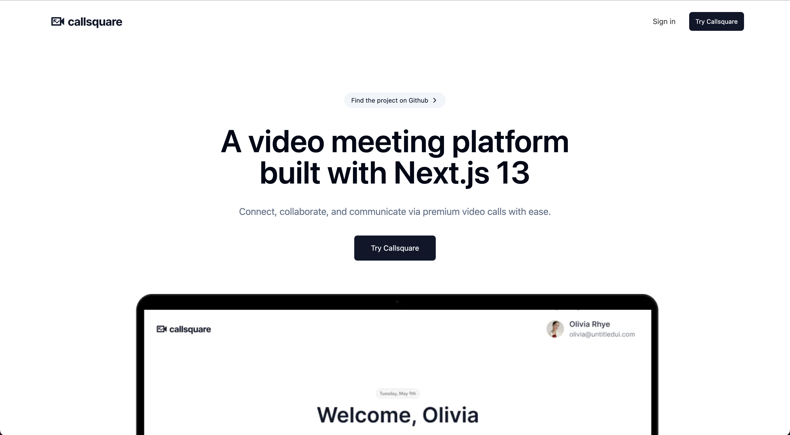

# Callsquare

> **Warning**
> This is a work-in-progress and not the finished product.
>
> I work on this project fir an hour or so whenever I have free time during the night after work. Feel free to leave feature suggestions and/or contribute to the project.

[](https://callsquare.jaleelbennett.com/)

## About this project

This project was conceived as an experiment to explore the capabilities of Next.js 13. The primary objective was to build a modern application that incorporates a variety of features including, but not limited to, authentication, API route handlers, middleware, and server components.

The application is designed to simulate a video call platform, providing a practical context in which to apply and test these features. It leverages the power of Next.js 13 to handle server-side operations, routing, and server side rendering.

Key features of the application include:

- User Authentication: Ensuring secure access to the application and protecting user data.
- API Routes: Facilitating communication between the client and server, enabling data exchange for various application features.
- iddleware: Managing the sequence of functions that process requests and responses.
- Server Components: Utilizing Next.js 13's server components to deliver an optimized user experience.
T
his project is an ongoing experiment, with plans for further exploration and expansion of its capabilities.

## Known Issues

A list of things not working right now:

1. Share screen functionality is not working.
2. Join functionality for unauthenticated users is not working.
3. Discord authentication is not working.

## Tech Stack

- [Next.js](https://nextjs.org)
- [NextAuth.js](https://next-auth.js.org)
- [Prisma](https://prisma.io)
- [Tailwind CSS](https://tailwindcss.com)
- [100ms](https://100ms.live)
- [Shadcn UI](https://ui.shadcn.com)
- [React Email](https://react.email/)
- [Resend](https://resend.com/)

## Features to be implemented

- [x] Invite email with **React Email** and **Resend**
- [ ] Authentication with **Clerk**
- [ ] Scheduling calls
- [ ] Screen Annotations

## Installation

### 1. Clone the repository

```bash
git clone https://github.com/JaleelB/callsquare
```

### 2. Install dependencies

```bash
yarn
```

### 3. Create a `.env` file

Create a `.env` file in the root directory and add the environment variables as shown in the `.env.example` file.

## Contributing

Contributions are welcome! Please open an issue if you have any questions or suggestions. Your contributions are welcomed and will be acknowledged.
